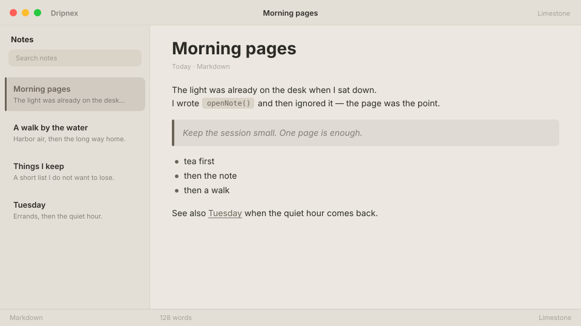

# Limestone

Warm-neutral stone. Editorial paper, not yellow cream.



```
dripnex/theme-limestone
```

## Palette

The chips live in [palette.html](palette.html) — open it in a browser. GitHub won’t paint HTML swatches here, so the hex list is below.

| Name | Token | Color | What it’s for |
| --- | --- | --- | --- |
| Base | `--bg-base` | `#ece8e1` | Window background |
| Surface | `--bg-surface` | `#e4dfd6` | Sidebar and chrome |
| Elevated | `--bg-elevated` | `#f4f1eb` | Raised panels |
| Text | `--text-primary` | `#2c2a26` | Headings and body |
| Muted | `--text-muted` | `#2c2a26 · rgba(44, 42, 38, 0.52)` | Secondary copy |
| Accent | `--accent` | `#6b6358` | Selection and links |
| Active | `--status-active` | `#6b6358` | Active status |
| Dropped | `--status-dropped` | `#a85a5a` | Dropped status |

Pick it for editorial stone light without parchment yellow.
